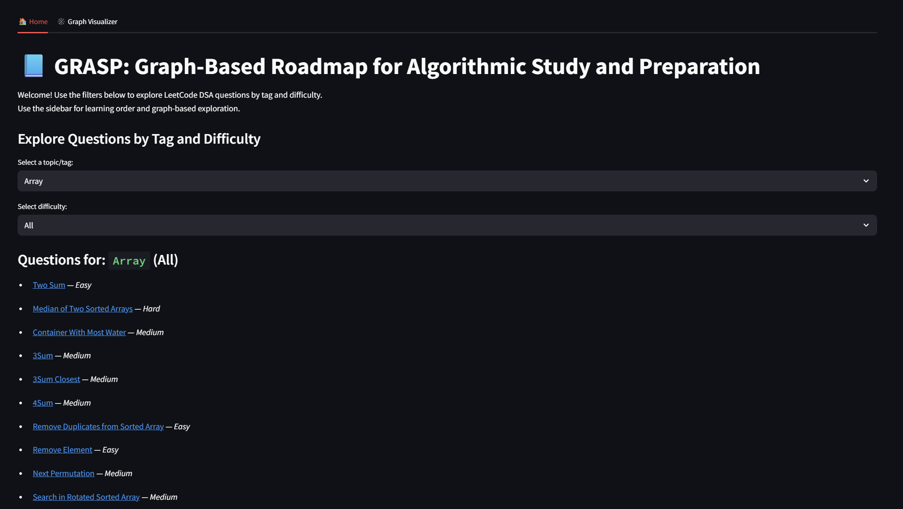

# GRASP: Graph-Based Roadmap for Algorithmic Study and Preparation

GRASP is an interactive Streamlit web app that helps you explore and plan your Data Structures & Algorithms (DSA) learning journey using graph-based visualizations. It leverages LeetCode questions, tags, and dependencies to create a roadmap for effective algorithmic study and preparation.

## Features

- **Explore DSA Questions:** Filter LeetCode questions by tag and difficulty.
- **Top-K Tags:** Instantly see the most frequent (central) tags/concepts across all questions.
- **Tag Recommendation:** Select tags you know/solved and get recommendations for new tags that frequently co-occur with them in questions.
- **Graph Visualizer:** Visualize topic dependencies and relationships interactively.
- **Learning Order:** View a topological sort of topics/questions for guided learning.
- **Graph Tools:** Analyze relationships using BFS and shortest path algorithms.
- **Related Topics:** Instantly discover related topics for any DSA concept.

## Demo

 <!-- Add a screenshot if available -->

## Getting Started

### Prerequisites

- Python 3.8 or higher

### Installation

1. **Clone the repository:**
    ```sh
    git clone https://github.com/yourusername/GRASP.git
    cd GRASP/project
    ```

2. **Install dependencies:**
    ```sh
    pip install -r requirements.txt
    ```

3. **Add your data:**
    - Place your LeetCode question data (CSV or compatible format) in the project directory as required by `data_loader.py`.

4. **Run the app:**
    ```sh
    streamlit run main_app.py
    ```

## Project Structure

```
project/
├── main_app.py
├── graph_models.py
├── data_loader.py
├── ui_sections.py
├── requirements.txt
└── ...
```

## Technologies Used

- [Streamlit](https://streamlit.io/) - Web app framework
- [PyVis](https://pyvis.readthedocs.io/) - Interactive graph visualization
- [Pandas](https://pandas.pydata.org/) - Data manipulation

## Contributing

Pull requests are welcome! For major changes, please open an issue first to discuss what you would like to change.


---

*Happy Learning!*